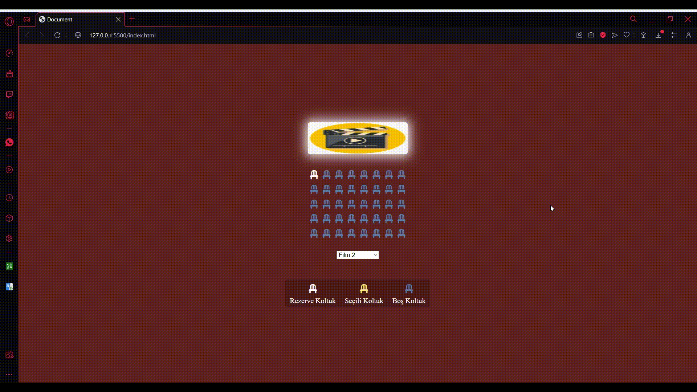

# Cinema-Reservation

# Sinema Rezervasyon Uygulaması

Bu proje, bir sinema rezervasyon uygulamasını temsil eder. HTML dosyası, sayfanın temel yapısını içerirken, SCSS ile stil ve Bootstrap Icons entegrasyonu sağlanmıştır.

## Dosya Yapısı

- **index.html:** Temel HTML yapısı ve sayfanın içeriği.
- **style.scss:** SCSS (Sass) dilinde yazılmış stil dosyası.
- **javascriptkods/main.js:** JavaScript dosyası.

## HTML Yapısı

### Header (Başlık)

- Sayfa başlığı
- CSS ve Bootstrap ikonları stil dosyalarının bağlantıları

### Navigation (Navigasyon)

- Anasayfa, Hakkımızda, İletişim gibi temel sayfa bağlantıları

### SCSS Bilgi Alanı

- CSS ve Sass hakkında bilgiler içeren bir bölüm

### Info Container (Bilgi Kutuları)

- Sass ile ilgili bilgiler içeren kutular

### Form Container (Form Alanı)

- İsim, Soyisim, Parola gibi bilgilerin alındığı bir form

### Footer (Alt Bilgi)

- İletişim bilgileri, Hakkımızda, Sosyal medya bağlantıları ve logo içeren alt bilgi

## SCSS Kullanımı

- **Mixin:** vs sınıfındaki V ve S harfleri arasındaki çizgiyi belirleyen border stilini içerir.
- **Kalıtım (Inheritance):** Örneğin, info-sec sınıfındaki stiller, form-area sınıfında kullanılarak tekrar edilmiştir.

## Bootstrap İkonları

Sayfada kullanılan ikonlar, Bootstrap Icons kütüphanesinden alınmıştır.

## Nasıl Çalıştırılır

1. Proje dosyalarını bilgisayarınıza indirin.
2. Tarayıcıda `index.html` dosyasını açarak sayfayı görüntüleyebilirsiniz.

## Geliştirme ve Katkı

Bu proje açık kaynaklıdır. Eğer katkıda bulunmak istiyorsanız, lütfen bir [issue](link) açın veya bir pull request gönderin.

